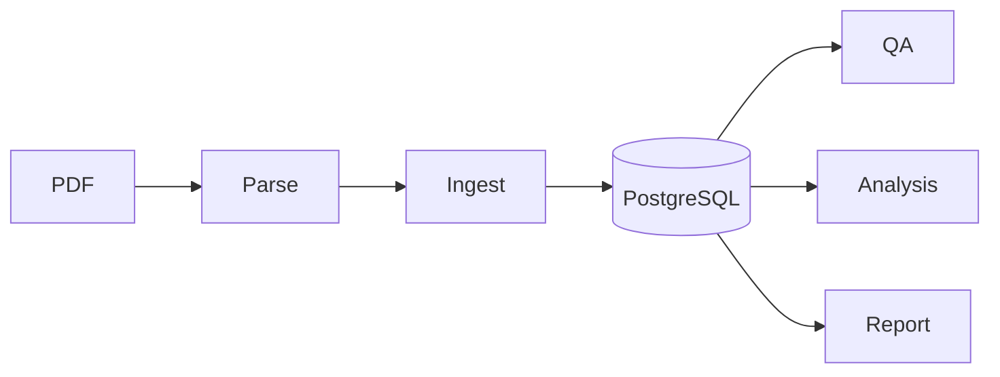

# CN Equity Report Analyzer

基于上市公司 PDF 年报的分析平台：**解析入库 → 混合检索问答 → 知识图谱 → 经营状况分析 → 三页 HTML 报告**。

| 能力 | 说明 |
|------|------|
| 结构化入库 | MinerU 解析 + 章节/表格/财务事实 + 向量索引 |
| 混合检索问答 | SQL / 向量 / KG 多路检索 + LLM 作答 |
| 知识图谱 | 股东、高管、子公司、关联方等关系抽取 |
| 经营状况分析 | KPI 异常检测、行业对标、MD&A 解释 |
| HTML 报告 | overview / graph / analysis 三页静态报告 |

完整文档：**[docs/README.md](docs/README.md)**

## 系统概览



详见 [docs/architecture.md](docs/architecture.md)。

## 快速开始

```bash
cp .env.example .env   # DATABASE_URL、OPENAI_API_KEY，见 docs/operations/setup.md

# 跑 ingest 前确认 PostgreSQL 已启动：psql "$DATABASE_URL" -c "SELECT 1"
python pipeline/parse/mineru_parse.py
python -m pipeline.ingest.ingest --with-relations --force
python -m pipeline.analysis.cli.mock_benchmark --report-id 1 --seed 42
python -m pipeline.analysis.cli.run --report-id 1 --skip-llm
python -m report.cli --report-id 1 --mode all --serve
```

逐步说明与验收：[docs/quickstart.md](docs/quickstart.md)

## 文档导航

| 读者 | 入口 |
|------|------|
| 快速上手 | [docs/quickstart.md](docs/quickstart.md) |
| 系统架构 | [docs/architecture.md](docs/architecture.md) |
| 入库指南 | [docs/guides/ingestion.md](docs/guides/ingestion.md) |
| 消费指南 | [docs/guides/consumption.md](docs/guides/consumption.md) |
| 环境与配置 | [docs/operations/setup.md](docs/operations/setup.md) |
| CLI 参考 | [docs/operations/cli-reference.md](docs/operations/cli-reference.md) |
| 数据库 | [docs/operations/database.md](docs/operations/database.md) |

## 仓库结构

```text
pipeline/parse/      PDF → parse_result/
pipeline/extract/  纯计算：text ∥ relations
pipeline/ingest/     写库 + embedding
pipeline/qa/         混合检索问答
pipeline/analysis/   经营状况分析
report/              Jinja2 HTML 报告
db/                  PostgreSQL DDL
docs/                技术文档
```

## 前置依赖

- **PostgreSQL 16+**（pgvector、pg_trgm）
- **MinerU**（PDF 解析）
- **OpenAI 兼容 API**（QA、可选 LLM 增强）

环境搭建：[docs/operations/setup.md](docs/operations/setup.md)
