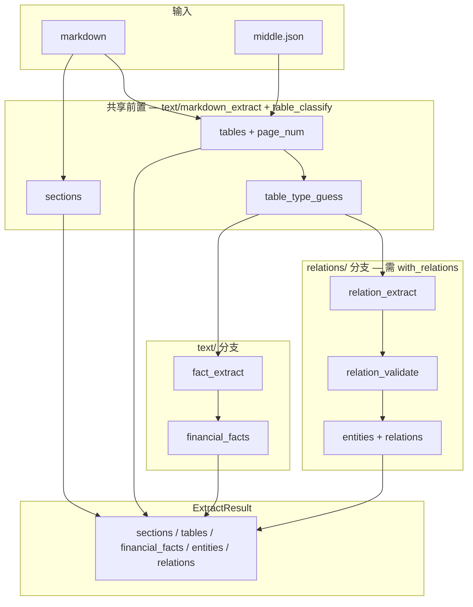
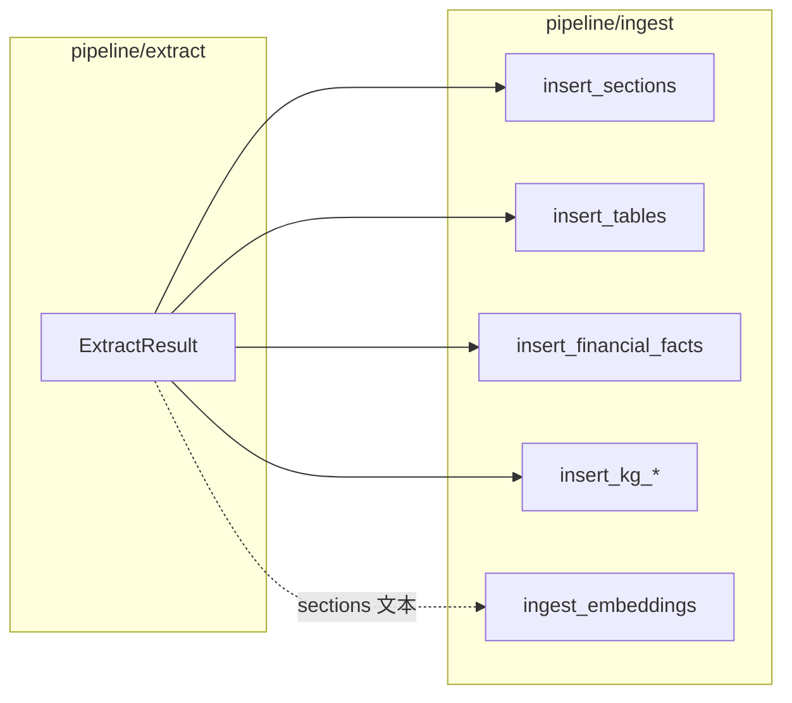

# 提取层（pipeline/extract）

> 文档索引：[README.md](README.md)

## 1. 定位

`pipeline/extract` 是 **纯计算层**：读取 MinerU 解析产物（markdown + middle.json），产出结构化对象，**不写数据库**。

入库由 [`pipeline/ingest/ingest.py`](../pipeline/ingest/ingest.py) 调用 [`runner.run_extract()`](../pipeline/extract/runner.py) 后统一写库。

提取层按职责拆为 **两个并列子包**，共享前置步骤，各自产出不同字段：

| 子包 | 目录 | 产出 | 写入表（ingest 阶段） |
|------|------|------|------------------------|
| **文本/表格抽取** | [`text/`](../pipeline/extract/text/) | sections、tables、financial_facts | `report_sections`、`structured_tables`、`financial_facts` |
| **关系抽取** | [`relations/`](../pipeline/extract/relations/) | entities、relations | `kg_entities`、`kg_relations`、`kg_relation_evidence` |

二者 **不是串行前后关系**：关系抽取不依赖 `financial_facts` 是否生成；二者在同一次 `run_extract()` 内并列执行，共用已分类的 `ParsedTable` 列表。

---

## 2. 并列架构



**执行顺序**（[`runner.py`](../pipeline/extract/runner.py)）：

1. **共享**：`split_sections` → `extract_tables` → `attach_page_numbers` → `guess_table_type`（每张表）
2. **text 分支**：`build_financial_facts(tables)` → `financial_facts`
3. **relations 分支**（`with_relations=True` 时）：`build_relations(tables, sections, …)` → `entities` / `relations`；可选 `refine_relations_from_text`
4. 组装为 `ExtractResult` 返回 ingest

步骤 2 与 3 之间 **无数据依赖**，仅共用步骤 1 的 `tables`（含 `table_type_guess`）。

---

## 3. 目录结构

```text
pipeline/extract/
  contracts.py          # 两侧共用的数据契约
  runner.py             # 编排共享前置 + 并列两分支
  __init__.py           # 对外导出 run_extract、契约类型、text 辅助函数

  text/                 # 文本/表格/财务事实（始终执行）
    markdown_extract.py # 章节、表格、页码、切块、公司元数据
    table_classify.py   # table_type_guess
    table_semantics.py  # 表语义工具（分类 + 关系抽取共用）
    fact_extract.py     # financial_facts

  relations/            # 关系/实体（--with-relations 时执行）
    relation_extract.py
    relation_validate.py
    text_relation_refiner.py
    llm_client.py
    eval/               # golden 与评测（见 relation_extract.md）
```

### 3.1 共享与分界

| 组件 | 归属 | 说明 |
|------|------|------|
| `Section`、`ParsedTable` | `contracts` | 两分支输入基础 |
| `table_classify`、`table_semantics` | `text/` | 分类服务 **两分支共用**；fact 与 relation 按 `table_type_guess` 各自路由 |
| `ExtractedFact` | `text/` 产出 | 仅 fact_extract 写入 |
| `ExtractedEntity`、`ExtractedRelation` | `relations/` 产出 | 仅 relation_extract 写入 |
| `chunk_text`、`strip_for_chunking` | `text/` 提供 | 供 **ingest** 做 embedding，不属于 extract 主流程产出 |

### 3.2 ExtractResult 字段

```python
@dataclass
class ExtractResult:
    sections: list[Section]              # text
    tables: list[ParsedTable]            # text（含 table_type_guess）
    financial_facts: list[ExtractedFact] # text 分支
    entities: list[ExtractedEntity]      # relations 分支（默认可空）
    relations: list[ExtractedRelation]   # relations 分支（默认可空）
    relation_candidates: list[dict]      # relations 分支摘要
```

默认 ingest（无 `--with-relations`）时，`entities` / `relations` 为空列表，**text 分支仍完整执行**。

---

## 4. 表类型路由：两分支各取所需

同一张表只分类一次（`table_type_guess`），**不同分支读取不同类型子集**：

| table_type_guess | text/ fact_extract | relations/ 抽取 |
|------------------|-------------------|-----------------|
| `key_financials_summary` | KPI 白名单 | — |
| `balance_sheet` / `income_statement` / `cashflow_statement` | 全行科目 | — |
| `top10_shareholders` | — | `shareholder_of` |
| `director_roster` | — | `executive_of` / `director_of` |
| `subsidiaries` | — | `subsidiary_of` / `invest_in` |
| `restricted_shares` | — | 不抽（分类用于排除） |

完整类型表见 [text_extract.md §5](text_extract.md#5-表分类table_classify)（财报类）与 [relation_extract.md §4](relation_extract.md#4-表分类table_type_guess)（关系类）。

---

## 5. 与 ingest 的衔接



- **text 分支产物** → sections / tables / facts → 结构化表 + 后续 `text_chunks`（详见 [text_extract.md](text_extract.md)）
- **relations 分支产物** → kg_* 表；仅当 `--with-relations` 时写入

---

## 6. 触发方式

提取层无独立 CLI，通过 [ingest.md](ingest.md) 调用。常用组合：

| 场景 | 命令 |
|------|------|
| 仅 text 分支 + embedding | `python -m pipeline.ingest.ingest --force` |
| text + relations | `python -m pipeline.ingest.ingest --with-relations --force` |
| 关系 + LLM 补漏 | `python -m pipeline.ingest.ingest --with-relations --refine-text-relations --force` |
| 跳过 embedding | 加 `--skip-embed` |

| 开关 | text 分支 | relations 分支 |
|------|-----------|----------------|
| （默认） | 执行 | 跳过 |
| `--with-relations` | 执行 | 执行 |
| `--skip-embed` | facts 仍写；embedding 跳过 | 不受影响 |

---

## 7. 分支文档

| 文档 | 范围 |
|------|------|
| 本文 | 提取层总览、并列架构、ExtractResult |
| [text_extract.md](text_extract.md) | **text/** 分支：章节、表格、分类、financial_facts、切块 |
| [relation_extract.md](relation_extract.md) | **relations/** 分支：规则、校验、golden |
| [ingest.md](ingest.md) | 写库、CLI、embedding |
| [eval.md](eval.md) | golden 回归 |
| [database_schema.md](database_schema.md) | 各产出对应表结构 |

## 8. 相关源码

| 文件 | 说明 |
|------|------|
| [`pipeline/extract/runner.py`](../pipeline/extract/runner.py) | 并列编排入口 |
| [`pipeline/extract/contracts.py`](../pipeline/extract/contracts.py) | 数据契约 |
| [`pipeline/extract/text/`](../pipeline/extract/text/) | 文本/表格/事实 |
| [`pipeline/extract/relations/`](../pipeline/extract/relations/) | 关系/实体 |
