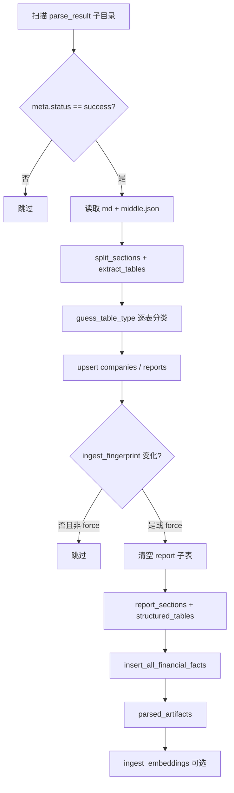

# 结构化入库

## 概述

入库模块将 MinerU 解析产物写入 PostgreSQL：章节结构、通用表格存储、财务指标事实表，以及用于语义检索的文本向量索引。设计面向 A 股上市公司定期报告全文，规则层不绑定单一公司或固定年份字面量。

**入口命令**：

```bash
export DATABASE_URL="postgresql://<user>@localhost:5433/re"
python -m pipeline.ingest.ingest_report
python -m pipeline.ingest.ingest_report --force          # 忽略指纹，重建子表数据
python -m pipeline.ingest.ingest_report --skip-embed   # 仅结构化，不写入向量
```

实现入口：[`pipeline/ingest/ingest_report.py`](../pipeline/ingest/ingest_report.py) → [`pipeline/ingest/ingest.py`](../pipeline/ingest/ingest.py)

数据库表说明见 [database_schema.md](database_schema.md)。

## 模块结构

| 文件 | 职责 |
|------|------|
| `config.py` | 路径、`DATABASE_URL`、embedding/切块参数、`DEFAULT_ALIASES` |
| `db.py` | 连接、公司/报告 upsert、子表清理、pgvector 字面量格式化 |
| `item_aliases.py` | 科目 canonical 别名（与 QA 检索共用） |
| `markdown.py` | 章节切分、HTML 表格抽取、页码映射、文本切块、公司信息推断 |
| `extract.py` | 表格类型推断、`financial_facts` 抽取 |
| `ingest.py` | 编排入库流程、embedding 写入、CLI |

## 处理流程



### 1. 章节（`report_sections`）

- 按 Markdown 标题（`#{1,6}`）切段，顺序号 `seq_no` 唯一。
- `section_key` 由 `section_aliases`（数据库 + `DEFAULT_ALIASES`）与**标题层级继承**共同决定：子节可继承父节的 `mda`、`financial_statements` 等键。
- `content_text` 为去掉表格与图片后的文本，供切块使用。

### 2. 表格（`structured_tables`）

- 每个 `<table>...</table>` 对应一行；`headers` / `rows` 存 JSONB。
- `table_type_guess` 由 `extract.guess_table_type` 根据表头、首列、章节键推断。
- 页码来自 `middle.json` 中表格 HTML 的 SHA256 与 MD 内表格 HTML 对齐。

**已支持表格类型（节选）**：

| `table_type_guess` | 典型用途 |
|--------------------|----------|
| `key_financials_summary` | 主要会计数据与财务指标（年度） |
| `quarterly_financials` | 分季度主要财务指标 |
| `balance_sheet` / `income_statement` / `cashflow_statement` | 合并三大报表 |
| `rd_investment_summary` | 研发投入金额与占比 |
| `rd_personnel_summary` | 研发人员数量与占比 |
| `company_profile_kv` | 股票简称、代码等 |
| `top10_shareholders` | 前十大股东（关系类问答预留） |

年份列识别使用 `20\d{2}` 正则，避免写死单一年份。

### 3. 财务事实（`financial_facts`）

从已分类表格抽取标准化数值行：

| `stmt_type` | 来源 |
|-------------|------|
| `kpi` | KPI 主表、分季度表 |
| `income` / `balance` / `cashflow` | 三大报表（全行抽取，跳过节标题行） |
| `operational` | 研发金额表、研发人员表 |

字段要点：

- `period_label` / `period_kind`：`year`、`quarter`、`point_in_time`
- `is_ratio`：比例、净资产收益率、同比增减列等为 `true`
- `unit`：`元`、`%`、`元/股`、`人` 等
- 唯一键：`(report_id, stmt_type, item_name, period_label)`

科目别名见 `item_aliases.py`（如「营收」与「营业总收入」互通）。

### 4. 向量索引（`text_chunks`）

- 按章节切块（默认 `CHUNK_SIZE=900`，`CHUNK_OVERLAP=120`）。
- 模型默认 `BAAI/bge-m3`，维度 1024，写入 `embedding` 列。
- 唯一键：`(report_id, section_id, chunk_index)`，保证同一章节下多子节不互相覆盖。

`ingest_fingerprint` 包含：PDF 哈希、md/middle 文件哈希、embedding 模型与切块参数。指纹不变时默认跳过整次入库（可用 `--force` 覆盖）。

## 配置

环境变量（可在 shell 或 `.env` 中设置）：

| 变量 | 默认 | 说明 |
|------|------|------|
| `DATABASE_URL` | `postgresql://trojan@localhost:5433/re` | PostgreSQL 连接串 |
| `EMBED_MODEL` | `BAAI/bge-m3` | SentenceTransformer 模型名 |
| `EMBED_DIM` | `1024` | 向量维度（需与库表一致） |
| `CHUNK_SIZE` | `900` | 切块字符长度 |
| `CHUNK_OVERLAP` | `120` | 切块重叠 |

章节别名除代码内 `DEFAULT_ALIASES` 外，可从表 `section_aliases` 加载（`is_active=true`，按 `priority` 排序）。

## 命令行参数

| 参数 | 说明 |
|------|------|
| `--parse-root` | 覆盖默认 `pipeline/parse/parse_result` |
| `--force` | 删除该报告下 sections/tables/facts/chunks 后重建 |
| `--skip-embed` | 不加载 embedding 模型，不写入 `text_chunks` |

成功时 stdout 输出 JSON 摘要，例如：

```json
{
  "status": "success",
  "report_id": 1,
  "stock_code": "300059",
  "report_year": 2025,
  "sections": 579,
  "sections_with_key": 576,
  "tables": 279,
  "tables_typed": 14,
  "facts": 471
}
```

随后可能追加 `{"chunks": 488, "embedded": 488}`。

## 幂等与增量

| 层级 | 机制 |
|------|------|
| 解析 → 入库触发 | 每个 `parse_result` 子目录需有 `meta.json` 且 `status=success` |
| 入库跳过 | `parsed_artifacts.meta_json.ingest_fingerprint` 与本次计算一致 |
| 报告主键 | `reports.pdf_sha256` 唯一；同一 PDF 更新会 upsert 同行 |
| 子表重建 | 指纹变化或 `--force` 时 `DELETE` 该 `report_id` 下 sections/tables/facts/chunks 后重插 |

## 验收

```sql
SELECT stmt_type, COUNT(*) FROM financial_facts WHERE report_id = 1 GROUP BY 1;
SELECT table_type_guess, COUNT(*) FROM structured_tables
  WHERE report_id = 1 AND table_type_guess IS NOT NULL GROUP BY 1;
SELECT COUNT(*) FROM text_chunks WHERE report_id = 1 AND embedding IS NOT NULL;
```

更多 SQL 见 [database_schema.md §7](database_schema.md#7-常用验收-sql)。

## 故障排查

| 现象 | 处理建议 |
|------|----------|
| `No module named psycopg2` | 使用 Conda 环境 `RE`，勿用系统 Python |
| `facts` 数量极少 | 检查 `tables_typed`；表头是否匹配 `extract` 中分类规则 |
| 叙述问答无结果 | 是否使用了 `--skip-embed`；`text_chunks` 是否有 embedding |
| 入库 skipped | 正常指纹命中；改 md/切块/模型后需 `--force` |
| chunk 数远少于章节数 | 空 `content_md` 节会被跳过；检查 `section_id` 是否写入 |

完成入库后，参见 [qa.md](qa.md) 启动问答或 smoke 评测。
