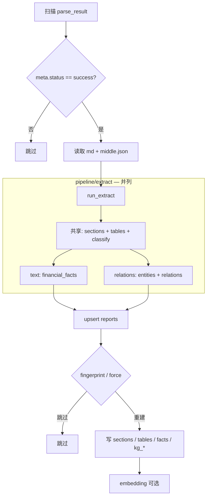

# 结构化入库

> 文档索引：[README.md](README.md)

入库模块将 MinerU 解析产物写入 PostgreSQL：章节、表格、财务事实、可选知识图谱，以及文本向量索引。

## 职责拆分

| 包 | 职责 |
|----|------|
| [`pipeline/extract`](../pipeline/extract/) | 纯计算：**text/** 与 **relations/** 并列抽取（见 [extract.md](extract.md)） |
| [`pipeline/ingest`](../pipeline/ingest/) | 事务编排、写库、幂等、embedding |

| 分支 | 开关 | 产出 → 表 |
|------|------|-----------|
| text（始终） | — | sections / tables / facts → `report_sections`、`structured_tables`、`financial_facts` |
| relations | `--with-relations` | entities / relations → `kg_*` |
| embedding | 默认开启；`--skip-embed` 跳过 | `text_chunks` |

分支细则：[text_extract.md](text_extract.md) · [relation_extract.md](relation_extract.md)

## 入口命令

```bash
# 结构化 + embedding（默认）
python -m pipeline.ingest.ingest

# 强制重建（修改抽取规则后必须）
python -m pipeline.ingest.ingest --force

# 跳过 embedding，仅结构化
python -m pipeline.ingest.ingest --skip-embed --force

# 结构化 + 知识图谱
python -m pipeline.ingest.ingest --with-relations --force

# 关系 + LLM 文本补漏（需 OPENAI_API_KEY）
python -m pipeline.ingest.ingest --with-relations --refine-text-relations --force
```

实现：[`pipeline/ingest/ingest.py`](../pipeline/ingest/ingest.py)

## 命令行参数

| 参数 | 说明 |
|------|------|
| `--parse-root` | 覆盖默认 `pipeline/parse/parse_result` |
| `--force` | 忽略 `ingest_fingerprint`，删除该 report 子表后重建 |
| `--skip-embed` | 不加载 embedding 模型，不写入 `text_chunks` |
| `--with-relations` | 启用关系抽取，写入 `kg_entities` / `kg_relations` / `kg_relation_evidence` |
| `--refine-text-relations` | 在 `--with-relations` 基础上 LLM 文本补漏 |

退出码：`0` 全部成功，`2` 存在失败报告。

## 处理流程



`run_extract` 内 text 与 relations **无先后依赖**；ingest 在同一事务中分别写入对应表。模块映射见 [extract.md §3](extract.md#3-目录结构)。

## 幂等与指纹

- **parse 侧**：`meta.json` 中 `status == success` 且产物完整才入库。
- **ingest 侧**：`parsed_artifacts.meta_json.ingest_fingerprint` 由 md/middle 内容哈希 + embedding/chunk 参数组成；未变且未 `--force` 时跳过重建。

## 验收

回归评测流程见 [eval.md](eval.md)。数据量与 SQL 见 [database_schema.md §7–§8](database_schema.md#7-常用验收-sql)。

## 相关文档

| 文档 | 说明 |
|------|------|
| [setup.md](setup.md) | 环境与 `.env` |
| [parse.md](parse.md) | 解析产物格式 |
| [extract.md](extract.md) | 提取层架构 |
| [eval.md](eval.md) | golden 回归 |
| [database_schema.md](database_schema.md) | 表结构 |
