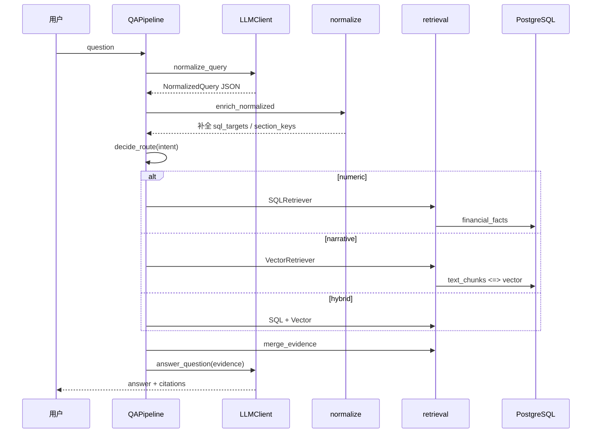

# 混合检索问答

## 概述

问答模块在已入库的年报数据上回答自然语言问题。采用 **查询标准化 → 意图路由 → 多路检索 → 证据合并 → LLM 生成** 的流水线：数值类问题走 SQL 结构化事实，叙述类走 pgvector 语义检索，关系类预留知识图谱接口并与表格检索组合。

**依赖**：PostgreSQL（含 `financial_facts`、`text_chunks`）、OpenAI 兼容 API（查询标准化与作答）。

## 模块结构

| 文件 | 职责 |
|------|------|
| `config.py` | LLM、检索 Top-K、超时；加载 `qa/.env` |
| `schemas.py` | `NormalizedQuery`、`EvidenceItem`、`QAResponse` 等 Pydantic 模型 |
| `normalize.py` | 粒度推断、期间标签、科目别名展开、意图规则修正 |
| `llm.py` | Jinja 模板 + OpenAI 客户端：标准化 JSON、生成回答 |
| `retrieval.py` | `SQLRetriever`、`VectorRetriever`、`KGRetriever`、`merge_evidence` |
| `pipeline.py` | `QAPipeline`、`QASession`、路由与 `ask` 编排 |
| `cli.py` | 交互式 REPL、单次问答、终端输出 |
| `smoke_eval.py` | 基于 golden 问题的批量回归 |
| `templates/` | `query_normalize.j2`、`answer_generate.j2` |
| `eval/golden_questions.json` | 评测用例与期望约束 |

## 问答流程



### 意图类型（`intent`）

| 意图 | 路由 | 说明 |
|------|------|------|
| `numeric` | 仅 SQL | 金额、比例、同比、报表科目 |
| `narrative` | 仅向量 | 主要业务、经营讨论等叙述 |
| `relational` | SQL 表格 + KG（占位） | 股东、高管、关联方等 |
| `hybrid` | SQL + 向量 | 如「业绩怎么样」类概览问题 |

`normalize.apply_intent_rules` 用规则覆盖常见 LLM 误判（例如「主要业务」强制 `narrative`；「业绩怎么样」强制 `hybrid` 并附带 KPI SQL 目标）。

### 查询标准化（`NormalizedQuery`）

| 字段 | 作用 |
|------|------|
| `canonical_question` | 规范化问句 |
| `report_year` | 报告年度上下文 |
| `section_keys` | 限制向量检索加分或 SQL 表格章节 |
| `sql_targets.item_names` | 展开别名后的科目名列表 |
| `sql_targets.period_labels` | 如 `2025`、`2025Q1` |
| `sql_targets.period_kinds` | `year` / `quarter` / `point_in_time` |
| `sql_targets.period_granularity` | 年度 / 季度 / 时点 |
| `vector_query` | 送入 embedding 的检索文本 |

LLM 失败时，`pipeline._fallback_normalize` 按关键词回退到规则标准化。

### SQL 检索（`SQLRetriever`）

- 对 `financial_facts` 做 `ILIKE` 匹配（经 `expand_item_names`）。
- 按 `period_kinds`、`stmt_types`、`period_labels` 过滤；年度问题排除 `quarter` 行。
- 比例类问题优先 `is_ratio = true`，无结果时自动放宽条件重试。
- `fact_rank_score` 对 KPI 主表、期间类型加权排序。
- `relational` / `hybrid` 时额外检索 `structured_tables`  JSON 行样本。

### 向量检索（`VectorRetriever`）

- 使用与入库相同的 embedding 模型（默认 `bge-m3`）。
- pgvector 余弦距离 `<=>`；`section_keys` 命中时分数 ×1.15。
- 每个 `section_id` 独立切块，避免 MD&A 子节互相覆盖。

### 证据合并（`merge_evidence`）

按来源优先级去重排序：`financial_fact` > `structured_table` > `kg_relation` > `text_chunk`，截断至 `MAX_EVIDENCE`（默认 8）。

### 作答（`LLMClient.answer_question`）

将证据 JSON 填入 `answer_generate.j2`；系统提示要求**仅依据证据**作答。引用列表 `[section_key p.N]` 由证据元数据生成，非模型自由发挥。

## 配置

复制环境变量模板：

```bash
cp pipeline/qa/.env.example pipeline/qa/.env
```

| 变量 | 必填 | 说明 |
|------|------|------|
| `OPENAI_API_KEY` | 是 | API 密钥 |
| `OPENAI_BASE_URL` | 否 | 兼容端点，默认 OpenAI |
| `QA_LLM_MODEL` | 否 | 默认 `gpt-4o-mini` |
| `DATABASE_URL` | 否 | 默认与 ingest 相同 |
| `EMBED_MODEL` | 否 | 与入库一致 |
| `QA_SQL_TOP_K` | 否 | 默认 5 |
| `QA_VECTOR_TOP_K` | 否 | 默认 5 |
| `QA_MAX_EVIDENCE` | 否 | 默认 8 |
| `QA_MAX_SESSION_TURNS` | 否 | 会话保留轮数，默认 5 |

## 命令行

### 交互式 REPL

```bash
python -m pipeline.qa.cli --report-id 1
```

| 命令 | 作用 |
|------|------|
| `/report <id>` | 切换报告 |
| `/history` | 查看最近对话摘要 |
| `/clear` | 清空会话上下文 |
| `/help` | 帮助 |
| `/exit` | 退出 |

### 单次问答

```bash
python -m pipeline.qa.cli --report-id 1 --query "2025年营业总收入是多少"
python -m pipeline.qa.cli --report-id 1 --query "公司主要业务有哪些" --json
```

`--json` 输出 `answer`、`citations`、`normalized`、`evidence` 完整结构。

### Smoke 评测

```bash
python -m pipeline.qa.smoke_eval
python -m pipeline.qa.smoke_eval --category metric
python -m pipeline.qa.smoke_eval --output pipeline/qa/eval/smoke_results.json
```

- 用例定义：`eval/golden_questions.json`
- 结果写入 `eval/smoke_results.json`，含 `auto_check`（关键词、粒度、`min_evidence` 等）
- 自动检查仅供参考，需结合 `answer` / `evidence` 人工核对

## 能力边界（当前实现）

| 能力 | 状态 |
|------|------|
| 年度 / 分季度 KPI、三大报表科目、研发比例与人员 | 已支持（SQL） |
| 营收等口语别名 | 已支持（`item_aliases`） |
| MD&A、公司简介等叙述 | 已支持（向量） |
| 董事长、第一大股东等关系事实 | 部分依赖 LLM 路由与表格命中；KG 检索为空实现 |
| 跨报告、跨公司联合问答 | 未支持（单 `report_id` 会话） |

## 故障排查

| 现象 | 处理建议 |
|------|----------|
| `Missing required env: OPENAI_API_KEY` | 配置 `pipeline/qa/.env` |
| 数值题答错或「未披露」 | 查 `financial_facts` 是否有对应 `item_name` / `period_label`；看 `normalized.sql_targets` |
| 叙述题答非所问 | 确认已跑 embedding；检查 `text_chunks` 数量与 `section_key` |
| 季度题命中年度数 | 看 `period_granularity` 是否为 `quarterly` |
| smoke 关系题失败 | E 类用例常因 `section_keys` 与表数据未对齐，属已知限制 |

## 相关文档

- 数据表与验收 SQL：[database_schema.md](database_schema.md)
- 解析产物格式：[parse.md](parse.md)
- 入库与指标抽取：[ingest.md](ingest.md)
