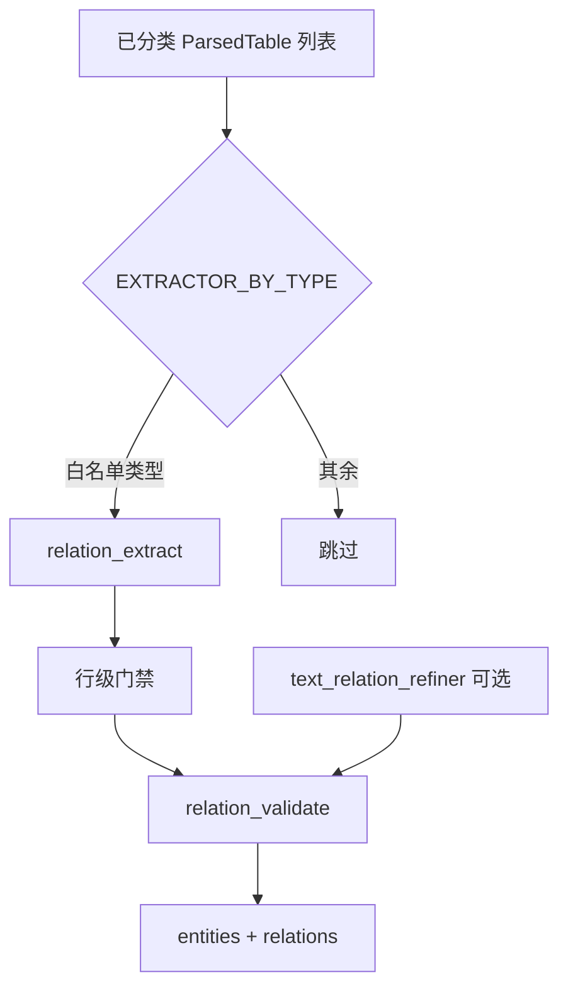

# 关系抽取

> **文档范围**：`pipeline/extract/relations/` 关系分支。  
> **文档索引**：[README.md](README.md) · 并列架构见 [extract.md](extract.md)

## 1. 概述

关系分支从已分类表格（`ParsedTable` + `table_type_guess`）中抽取实体与关系，产出 `ExtractResult.entities` / `ExtractResult.relations`，由 ingest 写入 `kg_*` 表。

**前置条件**：共享阶段已完成（sections、tables、classify），由 [`runner.run_extract()`](../pipeline/extract/runner.py) 在同一调用内先执行；关系分支 **不依赖** `financial_facts`。

设计目标：

1. **表类型驱动**：仅对已分类且命中白名单的表格执行抽取，不做 section/header 宽松 fallback。
2. **精度优先**：汇总行、职务标签、会计科目、错配表类型一律拒绝；宁可漏抽，不误写入库。
3. **规则为主**：默认 ingest 路径仅使用规则抽取；LLM 文本补漏为可选开关，且必须通过同一套校验函数。
4. **可验收**：分类与关系均配备 golden 用例，支持自动化回归。

适用范围：当前实现针对 **A 股年度报告** 常见表头与章节结构，不依赖特定公司名或股票代码硬编码。

---

## 2. 在提取层中的位置

```text
run_extract()
  ├─ [共享] markdown_extract → tables + sections
  ├─ [共享] table_classify    → table_type_guess
  ├─ [text 分支] fact_extract → financial_facts     ← 见 text_extract.md
  └─ [relations 分支] relation_extract → entities, relations   ← 本文
```

模块目录：

```text
pipeline/extract/relations/
    relation_extract.py     # 规则抽取（白名单路由）
    relation_validate.py    # 共享校验
    text_relation_refiner.py# 可选 LLM 补漏
    llm_client.py           # OpenAI 兼容客户端
    eval/
      golden_tables.json
      golden_relations.json
      table_classify_eval.py
      relation_eval.py
```

入库写入见 [ingest.md](ingest.md)；并列架构见 [extract.md](extract.md)。

---

## 3. 关系分支处理流程



> 输入 `TBL` 来自共享阶段 `table_classify`，与 `fact_extract` 读同一份 tables，互不调用。

**关键约束**：

- `table_type_guess` 为 `NULL` 或非白名单类型时，**不抽取**任何关系。
- 规则产出与 LLM 产出均须通过 `validate_relation()`，否则丢弃。
- `source_key` 格式：`{relation_type}|{subject_key}|{object_key}|{table_seq}`，作为 `(report_id, source_key)` 唯一 upsert 键。

---

## 4. 表分类（`table_type_guess`）

分类器见 [`pipeline/extract/text/table_classify.py`](../pipeline/extract/text/table_classify.py)，基于 `table_semantics.table_text_blob()` 对 **headers 与前 N 行全部单元格** 拼接后匹配规则（修复嵌套表头仅扫描第 0 列导致的前 10 股东漏分类问题）。

### 4.1 关系相关类型

| table_type_guess | 识别要点 | 是否抽取关系 |
|------------------|----------|--------------|
| `top10_shareholders` | 「股东名称」+「持股比例/持股数量」 | 是 → `shareholder_of` |
| `controller_info` | 「控股股东/实际控制人」 | 是 → `actual_controller_of` |
| `director_roster` | 「姓名」+「职务」+「性别/任职状态」 | 是 → `executive_of` / `director_of` |
| `subsidiaries` | section=`subsidiaries`，含「公司名称/主要业务」 | 是 → `subsidiary_of` / `invest_in` |
| `related_party_transactions` | 「关联方」+ 交易内容/发生额 | 是 → `transaction_with` |
| `related_party_list` | 「关联方名称/合营或联营企业名称」 | 是 → `related_party_of` |
| `restricted_shares` | 「限售」+「股东名称」，无「持股比例」 | 否 |
| `shareholder_count_summary` | 「普通股股东总数/股份变动」类 KV 宽表 | 否 |
| `director_concurrent_jobs` | 「其他单位名称」 | 否 |
| `director_changes` | 「被选举/聘任/离任」 | 否 |
| `director_compensation` | 「薪酬/报酬/税前报酬」 | 否 |
| `director_bio` | 传记段落表（「XX女士/先生：…」） | 否 |
| `related_party_balance` | 「关联方」+「期末余额/账面余额」 | 否 |
| `related_party_guarantee` | 「关联担保/重大担保」 | 否 |

### 4.2 财报与其他类型

`key_financials_summary`、`balance_sheet`、`income_statement`、`cashflow_statement` 等类型服务于 `fact_extract`，**不参与关系抽取**。多类型冲突时取 priority 最小者（关系类 10–23，财报类 30+）。

### 4.3 分类覆盖率说明

全报告表格中仅部分会被分类（report_id=1：279 张表中约 35 张有 `table_type_guess`）。本迭代验收范围是 **关系相关章节 26 张表** 分类正确（见 §7.1），而非要求全报告 100% 分类。

---

## 5. 规则抽取（`relation_extract.py`）

白名单路由：

```python
EXTRACTOR_BY_TYPE = {
    "top10_shareholders": extract_shareholders_top10,
    "controller_info": extract_controller,
    "director_roster": extract_directors_roster,
    "subsidiaries": extract_subsidiaries,
    "related_party_transactions": extract_related_transactions,
    "related_party_list": extract_related_party_list,
}
```

### 5.1 行级门禁（摘要）

| 抽取器 | 门禁条件 |
|--------|----------|
| 前 10 股东 | 拒绝汇总行；名称须像人名或机构名；**持股比例须为有效百分比**（`is_valid_share_ratio`）；遇段落标题行（如「前 10 名无限售…」）停止迭代 |
| 实控人 | 仅 `controller_info`；姓名须像人名 |
| 董监高 | 仅 `director_roster`；须同时有姓名、职务、性别或任职状态；拒绝职务标签作姓名；同人同 relation_type 去重 |
| 子公司 | 公司名列须像机构名；拒绝汇总行 |
| 关联方 | 关联方列须像机构名；拒绝会计科目 |

### 5.2 支持的关系类型

| relation_type | 说明 |
|---------------|------|
| `shareholder_of` | 股东 → 本公司；attrs 含 `ratio`、`share_count`、`shareholder_nature` |
| `actual_controller_of` | 实控人/控股股东 → 本公司 |
| `executive_of` / `director_of` | 高管/董事 → 本公司；attrs 含 `title`、`status` |
| `subsidiary_of` | 子公司 → 本公司 |
| `invest_in` | 本公司 → 子公司 |
| `related_party_of` | 关联方 → 本公司 |
| `transaction_with` | 关联方 ↔ 本公司（关联交易） |

---

## 6. 校验层（`relation_validate.py`）

`validate_entity_name()` 与 `validate_relation()` 供规则抽取与 LLM 补漏共用：

- 拒绝 subject/object 为汇总行、职务标签、会计科目。
- `shareholder_of` 要求 attrs 含有效 `ratio`（百分比格式）或 `share_count`。
- `related_party_of` / `transaction_with` 要求 subject 像机构名。
- `actual_controller_of` 要求 subject 像人名。

---

## 7. 评测与验收

### 7.1 表分类 golden

文件：[`pipeline/extract/relations/eval/golden_tables.json`](../pipeline/extract/relations/eval/golden_tables.json)

```bash
python -m pipeline.extract.relations.eval.table_classify_eval --report-id 1
```

覆盖 report_id=1 关系章节 **26 张表**，要求 `passed == total`（当前基线：26/26）。

### 7.2 关系 golden

文件：[`pipeline/extract/relations/eval/golden_relations.json`](../pipeline/extract/relations/eval/golden_relations.json)

支持用例类型：

| type | 含义 |
|------|------|
| `must_exist` | 指定 subject + relation_type + object 子串必须存在 |
| `must_have_attrs` | 关系 attrs 须含指定字段（如 `ratio`） |
| `must_not_exist` | forbidden_subjects 或 forbidden_evidence_title_contains 不得出现 |
| `count_range` | 某 relation_type 条数落在 [min, max] |

```bash
python -m pipeline.extract.relations.eval.relation_eval --report-id 1
```

### 7.3 推荐验收顺序

完整命令与通过标准见 [eval.md](eval.md#关系分支推荐顺序)。

---

## 8. 入库

须 `--with-relations`；修改规则后 `--force`。命令详见 [ingest.md](ingest.md)。

LLM 文本补漏：`--refine-text-relations`（需 `OPENAI_API_KEY`）。

---

## 9. 已知误抽取类型与对策

| 编号 | 现象 | 对策 |
|------|------|------|
| E1 | 合计/小计作实体 | `is_summary_row` |
| E2 | 限售股表误作股东；前 10 漏抽 | `top10_shareholders` vs `restricted_shares` 分流；全列 blob |
| E3 | 职务标签作姓名 | `director_roster` 行完整性 + `is_role_label` |
| E4 | 兼职表误作本公司董监高 | `director_concurrent_jobs` 不进入白名单 |
| E5 | 坏账准备等会计科目作关联方 | `related_party_balance` 不抽 + org 名校验 |
| E6 | source_key 覆盖 | source_key 含 `table_seq` |
| E7 | 前 10 股东漏抽 | 嵌套表头解析 + golden_tables 门禁 |
| E8 | LLM 噪声 | `validate_relation` 统一过滤 |

---

## 10. report_id=1 基线

在 `--with-relations --skip-embed --force` 后的关键指标见 [eval.md §report_id=1 基线](eval.md#report_id1-基线)。验收 SQL 见 [database_schema.md §8](database_schema.md#8-知识图谱表)。

---

## 11. 相关文件

| 文件 | 说明 |
|------|------|
| [extract.md](extract.md) | 提取层总览（text ∥ relations 并列） |
| [text_extract.md](text_extract.md) | text/ 分支 |
| [ingest.md](ingest.md) | 入库总流程 |
| [database_schema.md](database_schema.md) | KG 表结构 |
| [qa.md](qa.md) | QA 中 `KGRetriever` 消费 `kg_relations` |
| [eval.md](eval.md) | golden 回归 |
| [report.md](report.md) | 关系图谱预览 |
| [db/schema_kg.sql](../db/schema_kg.sql) | KG 建表脚本 |
