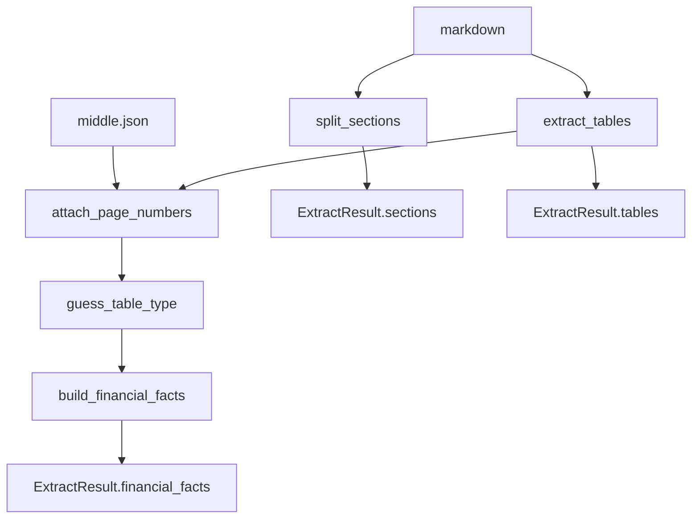

# 文本与表格抽取

> **文档范围**：`pipeline/extract/text/` 文本分支。  
> **文档索引**：[README.md](README.md) · 并列架构见 [extract.md](extract.md)

## 1. 概述

文本分支将 MinerU 输出的 markdown 与 middle.json 转为：

| 产出 | 类型 | ingest 写入表 |
|------|------|---------------|
| 章节 | `Section` | `report_sections` |
| 表格 | `ParsedTable`（含 `table_type_guess`） | `structured_tables` |
| 财务事实 | `ExtractedFact` | `financial_facts` |

此外，`text/` 提供 **切块与指纹辅助函数**（`chunk_text`、`strip_for_chunking` 等），供 ingest 生成 `text_chunks` embedding；该步骤在 ingest 内执行，不属于 `run_extract()` 的返回值。

**执行条件**：默认 ingest **始终运行** text 分支，无需额外开关。与 relations 分支并列，见 [`runner.run_extract()`](../pipeline/extract/runner.py)。

---

## 2. 在提取层中的位置

```text
run_extract()
  ├─ [共享 · 本文] markdown_extract → sections, tables, page_num
  ├─ [共享 · 本文] table_classify    → table_type_guess
  ├─ [text 分支 · 本文] fact_extract → financial_facts
  └─ [relations 分支] relation_extract → entities, relations   ← 见 relation_extract.md
```

模块目录：

```text
pipeline/extract/text/
  markdown_extract.py   # 章节、HTML 表格、页码、公司元数据、切块辅助
  table_classify.py       # table_type_guess（relations 分支共用）
  table_semantics.py      # 表 blob、嵌套表头、denylist（两分支共用）
  fact_extract.py         # financial_facts
```

并列架构见 [extract.md](extract.md)；写库见 [ingest.md](ingest.md)。

---

## 3. 处理流程



**阶段说明**：

1. **章节切分**（`split_sections`）：按 `#` 标题切分；`section_aliases` + 标题层级继承解析 `section_key`。
2. **表格抽取**（`extract_tables`）：正则匹配 `<table>` HTML，解析 headers/rows；按字符位置归属章节。
3. **页码映射**（`attach_page_numbers`）：middle.json 中 table html 哈希 → `page_num`。
4. **表分类**（`guess_table_type`）：基于 `table_semantics.table_text_blob` 全单元格匹配规则。
5. **事实抽取**（`build_financial_facts`）：按 `table_type_guess` 分组，白名单或全行抽取数值。

步骤 4 的分类结果同时供 relations 分支使用；fact_extract **仅消费**财报相关类型。

---

## 4. markdown_extract

实现：[`pipeline/extract/text/markdown_extract.py`](../pipeline/extract/text/markdown_extract.py)

| 函数 | 用途 |
|------|------|
| `split_sections` | markdown → `list[Section]` |
| `extract_tables` | markdown → `list[ParsedTable]` |
| `attach_page_numbers` / `build_table_page_map` | 表格页码 |
| `extract_company_info` | 股票代码、公司名、报告年度（ingest 推断 report） |
| `guess_exchange` | 交易所 SSE/SZSE |
| `strip_for_chunking` | 去表格/图片，供 embedding |
| `chunk_text` | 固定窗口切块（ingest 调用） |
| `compute_ingest_fingerprint` | 幂等指纹（md/middle/embed 参数） |

### 4.1 章节与 section_key

- 标题匹配：`pipeline/ingest/config.py` 中 `DEFAULT_ALIASES` + DB 表 `section_aliases`。
- **层级继承**：子节无直接 alias 时，继承上级已解析的 `section_key`（A 股「第三节 MD&A」容器 + 子节场景）。
- 注意：部分容器标题（如「管理层讨论与分析」）自身 `content_md` 可能为空，叙述检索依赖子节 `text_chunks`。

### 4.2 表格解析

- 使用 BeautifulSoup 解析 MinerU 输出的 HTML 表格。
- `table_seq` 为报告内顺序编号；`header_hash` 为表头 SHA256。
- `table_title` 取自表格所在章节的 `title_raw`（非表格内小标题）。

---

## 5. 表分类（table_classify）

实现：[`pipeline/extract/text/table_classify.py`](../pipeline/extract/text/table_classify.py)

分类器对 **全报告所有表格** 打 `table_type_guess`；text 分支与 relations 分支读同一份结果，各自按类型路由。

### 5.1 文本分支消费的 table_type

| table_type_guess | fact_extract 行为 | stmt_type |
|------------------|-------------------|-----------|
| `key_financials_summary` | KPI 白名单科目 + 同比增减列 | `kpi` |
| `quarterly_financials` | 分季度 KPI 白名单 | `kpi` |
| `balance_sheet` | 全行抽取（跳过节标题） | `balance` |
| `income_statement` | 全行抽取 | `income` |
| `cashflow_statement` | 全行抽取 | `cashflow` |
| `rd_investment_summary` | 研发投入金额与占比 | `operational` |
| `rd_personnel_summary` | 研发人员数量与结构 | `operational` |

关系相关类型（`top10_shareholders`、`director_roster` 等）由分类器识别，但 **fact_extract 不处理**，供 relations 分支使用。完整类型表见 [relation_extract.md §4](relation_extract.md#4-表分类table_type_guess)。

### 5.2 table_semantics

[`table_semantics.py`](../pipeline/extract/text/table_semantics.py) 提供：

- `table_text_blob`：headers + 前 N 行**全部单元格**（修复嵌套表头漏特征）
- `resolve_column_map` / `iter_data_rows`：主要为 relations 分支服务；分类器依赖 blob

---

## 6. 财务事实抽取（fact_extract）

实现：[`pipeline/extract/text/fact_extract.py`](../pipeline/extract/text/fact_extract.py)

入口：`build_financial_facts(tables, report_year)` → `list[ExtractedFact]`

### 6.1 ExtractedFact 字段

| 字段 | 说明 |
|------|------|
| `stmt_type` | `kpi` / `balance` / `income` / `cashflow` / `operational` |
| `item_name` | 科目名，如「营业总收入」 |
| `period_label` | `2025` / `2025Q1` / `2025年末` 等 |
| `period_kind` | `year` / `quarter` / `point_in_time` |
| `amount` | 数值（比例亦存于此，如 6.64 表示 6.64%） |
| `unit` | `元` / `%` / `元/股` / `人` |
| `is_ratio` | 是否为比率或同比列 |
| `table_seq` | 来源表序号 |

### 6.2 抽取规则摘要

- **KPI 主表**：`KPI_ITEMS` 白名单；匹配「一、营业总收入」等带序号前缀行。
- **分季度表**：`QUARTERLY_ITEMS` + 季度列头（第一季度…第四季度）。
- **三大报表**：`extract_all_rows=True`，跳过「其中：」「减：」等子科目噪声行。
- **比例识别**：列值以 `%` 结尾，或科目名含「收益率」「占比」等。
- **期间解析**：表头含 `2024`/`2025` 或「本期/上期发生额」→ 映射到 `period_label`。

科目口语别名（「营收」→「营业总收入」）在 QA 检索层通过 [`pipeline/ingest/item_aliases.py`](../pipeline/ingest/item_aliases.py) 扩展，extract 层存 canonical 名。

---

## 7. 向量切块（ingest 阶段）

`text_chunks` **不在** `ExtractResult` 中，由 ingest 在写库后调用 text 辅助函数完成：

```text
report_sections.content_md
  → strip_for_chunking
  → chunk_text(size, overlap)
  → embedding 模型
  → text_chunks
```

| 参数 | 默认来源 |
|------|----------|
| `CHUNK_SIZE` / `CHUNK_OVERLAP` | `pipeline/ingest/config.py` |
| `EMBED_MODEL` | 默认 `BAAI/bge-m3` |

`--skip-embed` 跳过本阶段；sections / tables / facts 仍正常写入。

---

## 8. 下游消费

| 产出 | 消费方 |
|------|--------|
| `financial_facts` | QA `SQLRetriever`（numeric / hybrid 意图） |
| `structured_tables` | QA 关系类问题的表格 JSON 样本 |
| `text_chunks` | QA `VectorRetriever`（narrative / hybrid） |
| `report_sections` | 切块来源、章节过滤 |

详见 [qa.md](qa.md)。

---

## 9. 验收

入库命令见 [ingest.md](ingest.md)。回归与基线见 [eval.md](eval.md)、[database_schema.md §7](database_schema.md#7-常用验收-sql)。

text 分支相关 SQL 示例：

```sql
SELECT COUNT(*) FROM report_sections WHERE report_id = 1;
SELECT COUNT(*) FROM structured_tables WHERE report_id = 1;
SELECT COUNT(*) FILTER (WHERE table_type_guess IS NOT NULL) FROM structured_tables WHERE report_id = 1;
SELECT stmt_type, COUNT(*) FROM financial_facts WHERE report_id = 1 GROUP BY 1 ORDER BY 2 DESC;
SELECT COUNT(*) FROM text_chunks WHERE report_id = 1 AND embedding IS NOT NULL;
```

---

## 10. 相关文件

| 文件 | 说明 |
|------|------|
| [extract.md](extract.md) | 提取层总览（text ∥ relations） |
| [ingest.md](ingest.md) | 写库、CLI、embedding |
| [relation_extract.md](relation_extract.md) | relations/ 分支 |
| [qa.md](qa.md) | 检索与问答 |
| [eval.md](eval.md) | 回归评测 |
| [database_schema.md](database_schema.md) | 表结构与基线 |

| 源码 | 说明 |
|------|------|
| [`text/markdown_extract.py`](../pipeline/extract/text/markdown_extract.py) | 章节、表格、切块 |
| [`text/table_classify.py`](../pipeline/extract/text/table_classify.py) | 表分类 |
| [`text/fact_extract.py`](../pipeline/extract/text/fact_extract.py) | 财务事实 |
| [`pipeline/ingest/item_aliases.py`](../pipeline/ingest/item_aliases.py) | 科目别名（QA 共用） |
