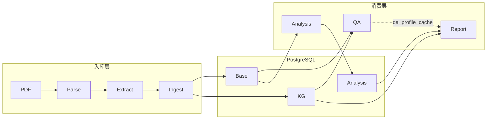

# 系统架构

## 定位

RE 是 **单报告域** 的年报分析平台：一份 PDF → PostgreSQL 知识库 → 三种消费形态（问答、经营状况分析、静态 HTML 报告）。不是通用 RAG 框架，不支持跨报告联合问答。



## 三条消费路径

| 路径 | 入口 | 读 | 写 |
|------|------|----|----|
| 问答 | `pipeline/qa/cli.py` | facts / chunks / KG | 无（会话内存） |
| 分析 | `pipeline/analysis/cli/run.py` | facts / chunks / benchmarks | `analysis_runs` 等 |
| 报告 | `report/cli.py` | DB + QA 缓存 | HTML + `qa_profile_cache.json` |

**模块依赖规则**：`qa`、`analysis`、`report` 互不 import；均只读 DB（report 的 overview 简介除外，会调 QA 并缓存）。`extract` 纯计算不写库；`ingest` 调用 `run_extract()` 后事务写库。

## 模块地图

```text
pipeline/
  parse/       MinerU → parse_result/{stem}/（md + middle.json + meta.json）
  extract/     run_extract() → ExtractResult
  ingest/      指纹幂等 + embedding + upsert
  qa/          normalize → route → SQL|Vector|KG → answer
  analysis/    metrics → detect → benchmark → explain → snapshots
report/
  providers/   聚合 DB 数据
  templates/   Jinja2 三页 HTML
db/
  schema_base.sql | schema_kg.sql | schema_analysis.sql
```

## 阶段契约

`pipeline/extract/contracts.py` 定义跨阶段数据结构：

| 类型 | 产出分支 | ingest 写入 |
|------|----------|-------------|
| `Section` | text | `report_sections` |
| `ParsedTable` | text（含 `table_type_guess`） | `structured_tables` |
| `ExtractedFact` | text | `financial_facts` |
| `ExtractedEntity` / `ExtractedRelation` | relations | `kg_*` |

`ExtractResult` 字段：`sections`, `tables`, `financial_facts`, `entities`, `relations`。默认 ingest 不启 relations 时，后两者为空列表。

### extract 并列架构

```text
run_extract()
  ├─ [共享] split_sections → extract_tables → attach_page_numbers → guess_table_type
  ├─ [text]     build_financial_facts
  └─ [relations] build_relations（--with-relations 时）
```

text 与 relations **无数据依赖**，共用已分类的 `ParsedTable` 列表。详见 [guides/ingestion.md](guides/ingestion.md)。

## 数据域

PostgreSQL 分三域，共 17 张业务表：

| 域 | 表 | 写入阶段 |
|----|-----|----------|
| **Base** | companies, reports, parsed_artifacts, report_sections, structured_tables, financial_facts, text_chunks, … | ingest |
| **KG** | kg_entities, kg_relations, kg_relation_evidence | ingest（`--with-relations`） |
| **Analysis** | industry_benchmarks, analysis_runs, metric_snapshots, metric_flags, flag_explanations | analysis.cli.run |

概念 ER 与逐表说明见 [operations/database.md](operations/database.md)。

## 幂等与缓存

| 阶段 | 机制 | 强制刷新 |
|------|------|----------|
| **parse** | `meta.json` 指纹（pdf_sha256 + parse_config） | `mineru_parse.py --force` |
| **ingest** | `ingest_fingerprint`（md/middle + embed/chunk 参数） | `ingest --force` |
| **analysis** | 每次 run 新写 `analysis_runs`；report 读最新 | 重新 `analysis.cli.run` |
| **QA（report 简介）** | `report/output/report_{id}/qa_profile_cache.json` | `--refresh-qa-profile` |
| **report HTML** | 覆盖写入静态文件 | 重新 `report.cli` |

修改抽取规则、embedding 参数或 QA 问句（`CACHE_VERSION`）后须对应 force / refresh。

## 设计原则

1. **阶段解耦** — extract 不写库；消费层只读 DB
2. **单报告域** — 一切以 `report_id` 为边界
3. **规则驱动 + LLM 增强** — 表格分类、关系抽取、异常检测以规则/YAML 为主；LLM 用于 QA 作答、解释分类、可选关系 refine
4. **精度优先（KG）** — 关系抽取宁可漏抽，不误写入库

## 相关文档

- 入库详解：[guides/ingestion.md](guides/ingestion.md)
- 消费详解：[guides/consumption.md](guides/consumption.md)
- 表结构：[operations/database.md](operations/database.md)
