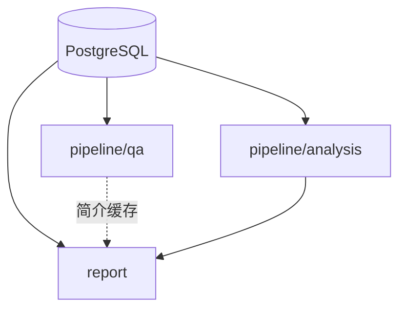

# 消费指南：QA / analysis / report

三条路径共享 PostgreSQL，互不 import。均以 `report_id` 为边界。

## 总览



---

## 问答（QA）

**入口**：`python -m pipeline.qa.cli`

流水线：查询标准化 → 意图路由 → SQL / 向量 / KG 检索 → 证据合并 → LLM 作答。

### 意图路由

| intent | 检索 |
|--------|------|
| `numeric` | 仅 SQL（`financial_facts`） |
| `narrative` | 仅向量（`text_chunks`） |
| `relational` | KG + 结构化表 |
| `hybrid` | SQL + 向量 |

### 命令

```bash
# 交互 REPL
python -m pipeline.qa.cli --report-id 1

# 单次问答
python -m pipeline.qa.cli --report-id 1 --query "2025年营业总收入是多少" --json
```

REPL 命令：`/report`, `/history`, `/clear`, `/exit`。

### 能力边界

| 支持 | 不支持 |
|------|--------|
| 年度/季度 KPI、三大报表、MD&A 叙述 | 跨报告联合问答 |
| 股东/高管/子公司（需 `--with-relations`） | QA 结果持久化（除 report 简介缓存） |

配置见 [operations/setup.md#配置](../operations/setup.md#配置) 中 QA 相关变量。

---

## 经营状况分析（analysis）

**入口**：`python -m pipeline.analysis.cli.run`

对 KPI 做 YoY 异常检测、行业对标、MD&A 解释检索，**写入 DB**：

| 表 | 内容 |
|----|------|
| `metric_snapshots` | 全量 KPI 快照（YoY、行业分位、status） |
| `metric_flags` | 规则触发的异常项 |
| `flag_explanations` | MD&A 检索解释 |

### 运行

```bash
python -m pipeline.analysis.cli.mock_benchmark --report-id 1 --seed 42
python -m pipeline.analysis.cli.run --report-id 1 --skip-llm
```

规则配置：[`pipeline/analysis/config/analysis_rules.yaml`](../../pipeline/analysis/config/analysis_rules.yaml)（YoY 阈值、行业离群、类别分组）。

**不在 ingest 中挂钩**；推荐顺序：ingest → mock_benchmark → analysis run → report。

公共 API：

```python
from pipeline.analysis import run_analysis, load_latest_analysis
latest = load_latest_analysis(report_id=1)
```

---

## HTML 报告（report）

**入口**：`python -m report.cli`

| mode | 内容 | 数据依赖 |
|------|------|----------|
| `overview` | 公司概况 + KPI 一览 | DB + 可选 QA 简介 |
| `graph` | 关系图谱 | `kg_*`（需 `--with-relations`） |
| `analysis` | 经营状况 dashboard + flags | `analysis_runs` |
| `all` | 三页一次渲染 | 上述全部 |

```bash
python -m report.cli --report-id 1 --mode all --serve
```

输出：`report/output/report_{id}/{mode}/index.html`

### overview 要点

- **公司简介**：QA 生成，不含主营业务条目（避免与下方重复）；缓存于 `qa_profile_cache.json`
- **主营业务**：QA 有序列表；`--skip-qa-profile` 时用 regex fallback
- **KPI**：优先 `metric_snapshots`；无 analysis 时降级 `financial_facts`

### 常用参数

| 参数 | 说明 |
|------|------|
| `--refresh-analysis` | 渲染前自动跑 mock_benchmark + analysis |
| `--refresh-qa-profile` | 强制重跑 QA 简介（默认读缓存） |
| `--skip-qa-profile` | 跳过 QA |
| `--serve` | 启动本地 HTTP（all 模式默认打开 overview） |

### 与 QA 的关系

report 与 qa **读同一 DB**，互不 import。overview 通过固定问句调 QA 生成简介/主营，结果缓存以避免重复 LLM 调用。

---

## 推荐全链路

```bash
python -m pipeline.ingest.ingest --with-relations --force
python -m pipeline.analysis.cli.mock_benchmark --report-id 1 --seed 42
python -m pipeline.analysis.cli.run --report-id 1 --skip-llm
python -m report.cli --report-id 1 --mode all --serve
```

## 相关文档

- [operations/cli-reference.md](../operations/cli-reference.md)
- [operations/troubleshooting.md](../operations/troubleshooting.md)
- [evaluation.md](evaluation.md)
