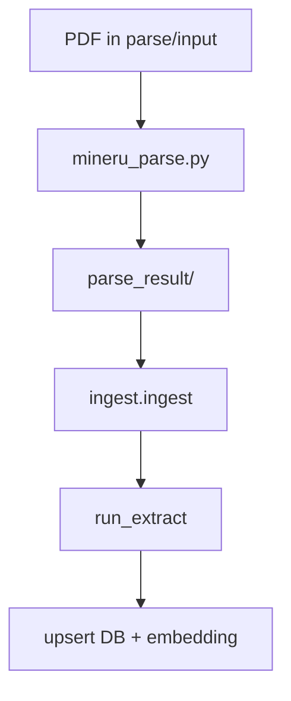

# 入库指南：parse → extract → ingest

本文覆盖从 PDF 到 PostgreSQL 的完整入库链路。

## 流程概览



## 1. PDF 解析（parse）

**入口**：`python pipeline/parse/mineru_parse.py`（非 `python -m`）

| 路径 | 说明 |
|------|------|
| `pipeline/parse/input/` | 待解析 PDF |
| `pipeline/parse/parse_result/{stem}/` | 单报告产物 |

产物：

| 文件 | 用途 |
|------|------|
| `meta.json` | 状态、指纹、产物路径 |
| `*.md` | 全文 Markdown（含 HTML 表格） |
| `*_middle.json` | 版面 JSON（表格页码） |

**幂等**：`status=success` 且指纹未变时跳过；`--force` 强制重解析。

常用参数：`--pdf`、`--out`、`--lang ch`、`--backend pipeline`、`--force`。

## 2. 提取层（extract）

`pipeline/extract` 为 **纯计算**，无独立 CLI，由 ingest 调用 `run_extract()`。

### 共享前置

1. `split_sections` — 按 `#` 标题切分，`section_aliases` 解析 `section_key`
2. `extract_tables` — BeautifulSoup 解析 `<table>`
3. `attach_page_numbers` — middle.json 映射页码
4. `guess_table_type` — 全表 `table_type_guess`（text 与 relations 共用）

### text 分支（始终执行）

产出 `financial_facts`，按 `table_type_guess` 路由：

| table_type | 行为 |
|------------|------|
| `key_financials_summary` / `quarterly_financials` | KPI 白名单 |
| `balance_sheet` / `income_statement` / `cashflow_statement` | 全行科目 |
| `rd_*` | 研发投入/人员 |

### relations 分支（`--with-relations`）

从白名单表类型抽取 KG 边，如 `top10_shareholders` → `shareholder_of`、`director_roster` → `executive_of`、`subsidiaries` → `subsidiary_of`。

设计原则：**表类型驱动、精度优先、规则为主**；LLM 文本补漏为可选（`--refine-text-relations`），须过同一套校验。

#### 关系去重

| 阶段 | 键 | 行为 |
|------|-----|------|
| **规则抽取** | `source_key`（含 `table_seq`，董监高名册含 `title`） | 同一 `(relation_type, subject, object)` 可有多条边（如一人兼董事长与总经理 → 两条 `executive_of`） |
| **LLM 补漏** | 语义键 `relation_type\|subject_key\|object_key` | 若规则边已存在同语义三元组，**不写入** LLM 边；rule 优先于 llm（attrs / 证据更完整） |

实现：`relation_extract.semantic_relation_key` / `prefer_relation`；合并逻辑在 `text_relation_refiner._merge_relations`。

DB 仍按 `(report_id, source_key)` upsert，见 [database.md §知识图谱](../operations/database.md#8-知识图谱表)。

### 科目归一化（item_aliases）

`pipeline/item_aliases.py` 提供 `normalize_item_name()`，供 extract、QA SQL 检索、analysis 快照、行业基准对齐使用。修改别名后须 `--force` ingest 并重新跑 analysis。

## 3. 入库（ingest）

**入口**：`python -m pipeline.ingest.ingest`

| 参数 | 说明 |
|------|------|
| `--force` | 忽略指纹，删除该 report 子表后重建 |
| `--skip-embed` | 不写 `text_chunks` |
| `--with-relations` | 写 `kg_*` |
| `--refine-text-relations` | LLM 关系补漏（需 API Key） |
| `--parse-root` | 覆盖默认 parse_result 路径 |

退出码：`0` 成功，`2` 部分失败。

写入映射：

| ExtractResult 字段 | 表 |
|--------------------|-----|
| sections | `report_sections` |
| tables | `structured_tables` |
| financial_facts | `financial_facts` |
| entities / relations | `kg_entities`, `kg_relations`, `kg_relation_evidence` |
| sections 文本 | `text_chunks`（embedding，除非 `--skip-embed`） |

**幂等**：`parsed_artifacts.meta_json.ingest_fingerprint` 未变且无 `--force` 时跳过重建。

## 常用命令组合

```bash
# 结构化 + embedding
python -m pipeline.ingest.ingest --force

# 结构化 + KG + embedding（推荐全功能）
python -m pipeline.ingest.ingest --with-relations --force

# 开发关系规则时跳过 embedding 加速
python -m pipeline.ingest.ingest --with-relations --skip-embed --force
```

## 相关文档

- 架构契约：[architecture.md](../architecture.md)
- 回归评测：[evaluation.md](evaluation.md)
- CLI 速查：[operations/cli-reference.md](../operations/cli-reference.md)
