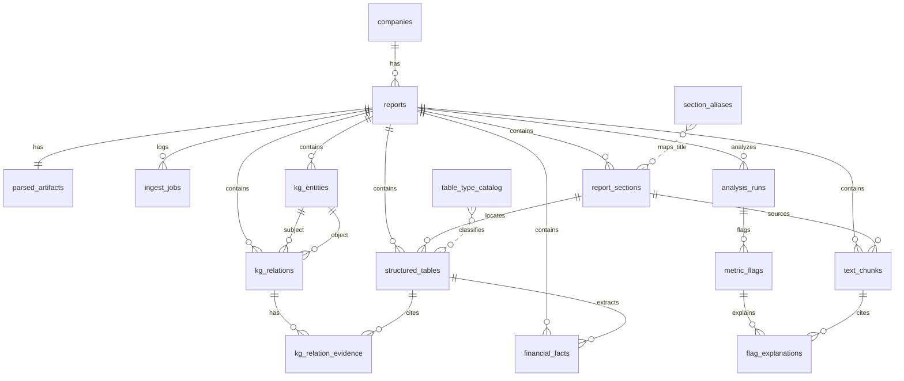

# 数据库表结构

> 文档索引：[docs/README.md](../README.md)  
> 数据库：PostgreSQL 16 + pgvector + pg_trgm  
> Schema：[db/schema_base.sql](../db/schema_base.sql) · [db/schema_kg.sql](../db/schema_kg.sql) · [db/schema_analysis.sql](../db/schema_analysis.sql)  
> 初始化：[setup.md](setup.md)

---

## 1. 表总览

| 分组 | 表名 | 作用 |
|------|------|------|
| 主数据 | `companies` | 上市公司主档 |
| 主数据 | `reports` | 年报/报告元数据 |
| 解析产物 | `parsed_artifacts` | MinerU 输出路径与入库指纹 |
| 任务日志 | `ingest_jobs` | 入库任务执行记录 |
| 章节 | `report_sections` | 按 markdown 标题切分的章节 |
| 字典 | `section_aliases` | 章节标题 → 标准键映射 |
| 表格 | `structured_tables` | PDF 中每个表格一行（JSON） |
| 字典 | `table_type_catalog` | 已知表格类型目录 |
| 财务事实 | `financial_facts` | 从关键表格抽取的标准化指标 |
| 向量检索 | `text_chunks` | 文本切块 + pgvector embedding |
| 知识图谱 | `kg_entities` / `kg_relations` / `kg_relation_evidence` | 实体关系及证据（见 [schema_kg.sql](../db/schema_kg.sql)） |
| 分析层 | `industry_benchmarks` / `analysis_runs` / `metric_flags` / `flag_explanations` | 行业基准与经营状况分析（见 [schema_analysis.sql](../db/schema_analysis.sql)） |

**共 17 张业务表**（不含扩展与触发器函数）。

---

## 2. 表关系图



---

## 3. 各表详细说明

### 3.1 `companies` — 公司主数据

**用途**：存储上市公司基本信息，一份公司对应多份年报。

| 字段 | 类型 | 说明 |
|------|------|------|
| `id` | BIGSERIAL | 主键 |
| `stock_code` | VARCHAR(16) | 股票代码，如 `300059`（唯一） |
| `stock_name` | VARCHAR(256) | 公司全称 |
| `exchange` | VARCHAR(16) | 交易所：`SSE` / `SZSE` / `BSE` |
| `industry` | VARCHAR(128) | 行业（可选） |
| `attrs` | JSONB | 扩展属性 |
| `created_at` / `updated_at` | TIMESTAMPTZ | 创建/更新时间 |

**唯一约束**：`stock_code`

---

### 3.2 `reports` — 报告元数据

**用途**：一份 PDF 年报对应一行，是多数业务数据的挂载根节点。

| 字段 | 类型 | 说明 |
|------|------|------|
| `id` | BIGSERIAL | 主键 |
| `company_id` | BIGINT | 外键 → `companies.id` |
| `report_year` | INT | 报告年度，如 `2025` |
| `report_type` | VARCHAR(32) | `annual` / `interim` / `q1` / `q3` |
| `title` | VARCHAR(512) | 报告标题 |
| `pdf_path` | TEXT | 原始 PDF 路径 |
| `pdf_sha256` | CHAR(64) | PDF SHA256，**幂等去重键** |
| `pdf_size_bytes` | BIGINT | 文件大小 |
| `page_count` | INT | 页数（可选） |
| `parse_status` | VARCHAR(32) | `pending` / `parsing` / `parsed` / `failed` |
| `parse_error` | TEXT | 解析失败原因 |
| `parsed_at` | TIMESTAMPTZ | 解析完成时间 |

**唯一约束**：`(company_id, report_year, report_type)`；`pdf_sha256`

---

### 3.3 `parsed_artifacts` — 解析产物索引

| 字段 | 类型 | 说明 |
|------|------|------|
| `report_id` | BIGINT | 外键 → `reports.id`（一对一） |
| `middle_json_path` | TEXT | `*_middle.json` |
| `markdown_path` | TEXT | `*.md` |
| `images_dir` | TEXT | 图片目录 |
| `meta_json` | JSONB | 含 `ingest_fingerprint`（md/middle/embed/chunk 参数哈希） |

---

### 3.4 `ingest_jobs` — 入库任务日志

记录 parse / ingest 任务状态，便于排错与审计。

---

### 3.5 `report_sections` — 报告章节

**用途**：将 markdown 按 `#` / `##` 标题切分为章节块；`section_key` 由 `section_aliases` + 标题继承规则解析。

| 字段 | 类型 | 说明 |
|------|------|------|
| `section_key` | VARCHAR(64) | 标准键，如 `mda`、`key_financials`（可空） |
| `title_raw` | TEXT | 原始标题 |
| `heading_level` | SMALLINT | 1=#，2=## |
| `content_md` | TEXT | 章节 markdown |
| `content_text` | TEXT | 去表格/图片后的纯文本（切块用） |
| `seq_no` | INT | 章节顺序 |

**唯一约束**：`(report_id, seq_no)`

> **注意**：A 股「第三节 管理层讨论与分析」常为容器标题，正文在子节；叙述检索应依赖 `text_chunks`（按 `section_id` 切块），而非仅查 `section_key='mda'` 的单条空节。

---

### 3.6 `section_aliases` — 章节别名映射

| alias_pattern | section_key | 说明 |
|---------------|-------------|------|
| `管理层讨论与分析` | `mda` | MD&A |
| `^五、主要会计数据和财务指标$` | `key_financials` | 第二节 KPI |
| `主要会计数据和财务指标` | `key_financials` | 无「五、」前缀变体 |
| `分季度主要财务指标` | `quarterly_financials` | 分季度表 |
| `前.?10.*股东\|前十名股东` | `top10_shareholders` | 股东表 |
| `第.*节.*财务报告` | `financial_statements` | 三大报表章节 |

代码侧默认别名见 [`pipeline/ingest/config.py`](../pipeline/ingest/config.py) 的 `DEFAULT_ALIASES`，与 DB 种子互补。

---

### 3.7 `structured_tables` — 通用表格存储

**用途**：PDF 中**每一个表格一行**；`table_type_guess` 由 ingest 规则推断（非 LLM）。

| 字段 | 类型 | 说明 |
|------|------|------|
| `table_seq` | INT | 报告内序号 |
| `headers` / `rows` | JSONB | 表头与行数据 |
| `table_type_guess` | VARCHAR(64) | 推断类型（见下表） |
| `section_key` | VARCHAR(64) | 所属章节 |

**当前已识别类型**：

**财报与经营类**（详见 [guides/ingestion.md](../guides/ingestion.md) §5）

| table_type_guess | 用途 |
|------------------|------|
| `key_financials_summary` | 主要会计数据（年度 KPI + 同比增减） |
| `quarterly_financials` | 分季度指标 |
| `balance_sheet` / `income_statement` / `cashflow_statement` | 三大报表 |
| `rd_investment_summary` | MD&A 研发投入金额与占比 |
| `rd_personnel_summary` | 研发人员数量与占比 |
| `company_profile_kv` | 公司简介 KV 表 |
| `bond_financials` / `glossary_terms` | 债券财务 / 释义 |

**关系相关类**（详见 [guides/ingestion.md](../guides/ingestion.md) §4）

| table_type_guess | 关系抽取 |
|------------------|----------|
| `top10_shareholders` | 是 |
| `controller_info` | 是 |
| `director_roster` | 是 |
| `subsidiaries` | 是 |
| `related_party_transactions` / `related_party_list` | 是 |
| `restricted_shares` / `director_compensation` / `related_party_balance` 等 | 否（分类用于排除误抽） |

> 分类器实现：[`pipeline/extract/text/table_classify.py`](../pipeline/extract/text/table_classify.py)，基于 [`table_semantics.table_text_blob`](../pipeline/extract/text/table_semantics.py) 全单元格扫描，支持嵌套表头。

---

### 3.8 `table_type_catalog` — 表格类型字典

维护典型表头特征与关联 `section_keys`，供规则与文档对齐；与 `table_type_guess` 运行时分类器一致。

---

### 3.9 `financial_facts` — 标准化财务指标

**用途**：从已分类表格抽取数值，供 QA **numeric/hybrid** 路径 SQL 检索。

| 字段 | 类型 | 说明 |
|------|------|------|
| `stmt_type` | VARCHAR(32) | `kpi` / `income` / `balance` / `cashflow` / `operational` / `other` |
| `item_name` | VARCHAR(256) | 科目名，如「营业总收入」 |
| `period_label` | VARCHAR(32) | `2025` / `2025Q1` / `2025年末` 等 |
| `period_kind` | VARCHAR(16) | `year` / `quarter` / `point_in_time` / `other` |
| `amount` | NUMERIC(24,4) | 数值（比例亦存于此，如 6.64 表示 6.64%） |
| `unit` | VARCHAR(16) | `元` / `%` / `元/股` / `人` 等 |
| `is_ratio` | BOOLEAN | 是否为比率或同比增减列 |
| `table_id` | BIGINT | 来源表 |

**唯一约束**：`(report_id, stmt_type, item_name, period_label)`

**抽取范围（当前实现）**：

- KPI 主表 + 分季度表：白名单科目 + YoY 增减列
- 三大报表：全行抽取（跳过节标题行）
- 研发金额/人员表：`stmt_type=operational`

科目口语别名（如「营收」→「营业总收入」）见 [`pipeline/item_aliases.py`](../pipeline/item_aliases.py)，extract / ingest / QA 共用。

---

### 3.10 `text_chunks` — 文本切块 + 向量

| 字段 | 类型 | 说明 |
|------|------|------|
| `section_id` | BIGINT | 外键 → `report_sections.id`（切块归属） |
| `section_key` | VARCHAR(64) | 冗余，便于过滤 |
| `chunk_index` | INT | 章节内序号 |
| `content` | TEXT | 可读文本 |
| `embedding` | VECTOR(1024) | 默认 `BAAI/bge-m3` |
| `embedding_model` | VARCHAR(128) | 模型名 |

**唯一约束**：`(report_id, section_id, chunk_index)`

> 旧版 `(report_id, section_key, chunk_index)` 会导致同一 `section_key` 下多子节互相覆盖；新库请执行迁移脚本。已有库需 `DELETE` 后重跑 embedding。

---

## 4. 扩展与函数

| 名称 | 说明 |
|------|------|
| `vector` | pgvector |
| `pg_trgm` | 标题模糊匹配 |
| `set_updated_at()` | 更新 `companies` / `reports` 时间戳 |

---

## 5. 数据流

```text
PDF
 → MinerU → parse_result/{报告名}/meta.json + *.md + *_middle.json
 → pipeline.ingest（结构化 + 可选 embedding + 可选关系）:
     companies / reports / parsed_artifacts
     report_sections
     structured_tables（每表一行 + table_type_guess）
     financial_facts（分类表 → 指标行）
     kg_entities / kg_relations / kg_relation_evidence（--with-relations）
     text_chunks（切块 + embedding）
 → pipeline.qa（Hybrid QA）:
     normalize → SQL / 向量 / KG 检索 → LLM 生成
 → report.cli（关系图谱 HTML 预览，见 [guides/consumption.md](../guides/consumption.md)）
```

---

## 6. 代码模块与表映射

提取层 **text / relations 并列**，详见 [architecture.md](../architecture.md)。

| 包 | 模块 | 分支 | 职责 |
|----|------|------|------|
| `pipeline/extract` | `runner.py` | — | 共享前置 + 并列编排 |
| | `contracts.py` | 共用 | `ExtractResult` |
| | `text/markdown_extract.py` | text | sections、tables、切块 |
| | `text/table_classify.py` | 共用 | `table_type_guess` |
| | `text/table_semantics.py` | 共用 | 表语义工具 |
| | `text/fact_extract.py` | text | `financial_facts` |
| | `relations/relation_extract.py` | relations | `kg_*` 数据源 |
| | `relations/relation_validate.py` | relations | 校验 |
| `pipeline/ingest` | `ingest.py` | — | 写库 + embedding |
| `pipeline/qa` | `retrieval/` | — | 消费 facts / kg / chunks |
| `report` | `cli.py` | — | 关系图谱预览 |

- text 分支 → [guides/ingestion.md](../guides/ingestion.md)  
- relations 分支 → [guides/ingestion.md](../guides/ingestion.md)

---

## 验收 SQL

```sql
-- 报告概览
SELECT id, report_year, parse_status FROM reports;

-- 各层数据量（以 report_id=1 为例）
SELECT 'sections' AS t, COUNT(*) FROM report_sections WHERE report_id = 1
UNION ALL SELECT 'tables', COUNT(*) FROM structured_tables WHERE report_id = 1
UNION ALL SELECT 'tables_typed', COUNT(*) FROM structured_tables WHERE report_id = 1 AND table_type_guess IS NOT NULL
UNION ALL SELECT 'facts', COUNT(*) FROM financial_facts WHERE report_id = 1
UNION ALL SELECT 'facts_ratio', COUNT(*) FROM financial_facts WHERE report_id = 1 AND is_ratio
UNION ALL SELECT 'chunks', COUNT(*) FROM text_chunks WHERE report_id = 1
UNION ALL SELECT 'embedded', COUNT(*) FROM text_chunks WHERE report_id = 1 AND embedding IS NOT NULL
UNION ALL SELECT 'kg_entities', COUNT(*) FROM kg_entities WHERE report_id = 1
UNION ALL SELECT 'kg_relations', COUNT(*) FROM kg_relations WHERE report_id = 1;

-- facts 按报表类型
SELECT stmt_type, COUNT(*) FROM financial_facts WHERE report_id = 1 GROUP BY stmt_type ORDER BY 2 DESC;

-- 表格类型分布
SELECT table_type_guess, COUNT(*) FROM structured_tables WHERE report_id = 1 AND table_type_guess IS NOT NULL GROUP BY 1;

-- chunk 按 section_key（勿 SELECT embedding 整列）
SELECT section_key, COUNT(*) FROM text_chunks WHERE report_id = 1 GROUP BY section_key ORDER BY 2 DESC;

SELECT section_key, chunk_index, LEFT(content, 120) FROM text_chunks WHERE report_id = 1 LIMIT 10;
```

**东方财富 2025 样例基线**（`--with-relations --skip-embed --force` 后）：

| 层 | 数量 |
|----|------|
| sections | 579 |
| tables | 279 |
| tables_typed | 35 |
| financial_facts | 471 |
| kg_entities | 29 |
| kg_relations | 35 |
| text_chunks（含 embed 时） | 488 |

---

## 8. 知识图谱表

| 表名 | 用途 |
|------|------|
| `kg_entities` | 实体（`company` / `person` / `organization` / `subsidiary`） |
| `kg_relations` | 关系边；`source_key` 唯一键含 `table_seq` |
| `kg_relation_evidence` | 证据（`table_row` / `section_text`）；`table_id` → `structured_tables` |

建表脚本：[`db/schema_kg.sql`](../db/schema_kg.sql)

写入：`python -m pipeline.ingest.ingest --with-relations --force`

设计说明：[guides/ingestion.md](../guides/ingestion.md)

**`kg_relations.source_key`**：入库唯一键，格式因来源而异：

- 规则边：`{relation_type}|{subject_key}|{object_key}|{table_seq}`；董监高名册可追加 `|{title}`
- LLM 边：`...|0|llm`

语义上相同的边（同 `relation_type` + 主体 + 客体）在 LLM 补漏阶段会去重，但规则边仍可按 `title` / `table_seq` 保留多条。

常用验收 SQL：

```sql
SELECT relation_type, COUNT(*) FROM kg_relations WHERE report_id = 1 GROUP BY 1 ORDER BY 2 DESC;

SELECT se.name, r.relation_type, r.attrs->>'ratio' AS ratio, r.source
FROM kg_relations r
JOIN kg_entities se ON se.id = r.subject_entity_id
WHERE r.report_id = 1 AND r.relation_type = 'shareholder_of'
ORDER BY se.name;

-- 负例检查：以下 subject 不应存在
SELECT se.name, r.relation_type
FROM kg_relations r
JOIN kg_entities se ON se.id = r.subject_entity_id
WHERE r.report_id = 1
  AND se.name IN ('合计', '坏账准备', '职工代表监事', '监事会主席', '合规总监');
```

---

## 10. 分析层表

建表脚本：[db/schema_analysis.sql](../db/schema_analysis.sql)。用法见 [guides/consumption.md](../guides/consumption.md)。

| 表 | 作用 |
|----|------|
| `industry_benchmarks` | 行业分位数基准（p25/p50/p75），`source` 区分 mock / external |
| `analysis_runs` | 单次分析运行元数据（report_id、config_version、stats） |
| `metric_snapshots` | 全量 KPI 快照（当年值、YoY、行业分位、status） |
| `metric_flags` | 规则触发的异常项（rule_id、severity、summary） |
| `flag_explanations` | 每条 flag 的 MD&A 检索解释 |

验收 SQL：

```sql
SELECT id, report_id, benchmark_source, stats->>'flag_count' AS flags,
       stats->>'snapshot_count' AS snapshots, created_at
FROM analysis_runs WHERE report_id = 1 ORDER BY created_at DESC LIMIT 3;

SELECT ms.item_name, ms.current_value, ms.yoy_pct, ms.status
FROM metric_snapshots ms
JOIN analysis_runs ar ON ar.id = ms.run_id
WHERE ar.report_id = 1
ORDER BY ar.created_at DESC, ms.item_name
LIMIT 20;

SELECT mf.item_name, mf.rule_id, mf.severity, mf.summary
FROM metric_flags mf
JOIN analysis_runs ar ON ar.id = mf.run_id
WHERE ar.report_id = 1
ORDER BY ar.created_at DESC, mf.severity
LIMIT 20;
```

---

## 相关文档

| 文档 | 说明 |
|------|------|
| [setup.md](setup.md) | 环境与建库 |
| [architecture.md](../architecture.md) | 模块与数据域 |
| [guides/ingestion.md](../guides/ingestion.md) | 入库与 KG |
| [guides/consumption.md](../guides/consumption.md) | QA / analysis / report |
| [db/schema_base.sql](../../db/schema_base.sql) | 建表与种子数据 |
